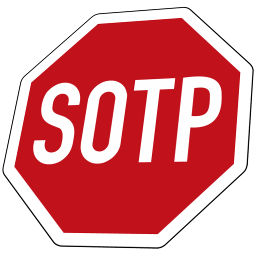

# *SOTP* 

**Table of contents**
*   [Definition](#definition)
*   [Details](#details)
*   [Components](#components)
*   [Requirements](#requirements)
*   [Documentation](#documentation)
*   [Contact](#contact)
*   [Useless facts](#useless-facts)

----

## Definition

The *SOTP* project is a simple tool for reading, modifying and writing *INI*-like config files.

[Top](#sotp)

## Details

The main purpose of SOTP is to simplify reading and writing config files with shell scripts. It parses INI-like config files and returns a requested value as a string, but is also able to modify existing (add or delete sections as well as options and change values) or create new files.

Its core module can be easily added to other projects and used for their config file operations.

[Top](#sotp)

## Components

The project consists of two basic components:

*   ***SOTP Reader*** The reader parses a config file and returns the value of a requested option from that file.
*   ***SOTP Writer*** The writer modifies existing or creates new config files.

[Top](#sotp)

## Requirements

In order to run *SOTP*, the *Python* framework must be installed on the system.

Depending on which version of the framework you are using:

*   *Python* 2.x (version 2.7 or higher is recommended, may also work with earlier versions)
*   *Python* 3.x (version 3.2 or higher is recommended, may also work with earlier versions)

[Top](#sotp)

## Documentation

Inside the `docs` sub-directories there are plain text files containing the documentation for each component with further information and usage examples.

[Top](#sotp)

## Contact

Any suggestions, questions, bugs to report or feedback to give?

You can contact me by sending an email to [dev@urbanware.org](mailto:dev@urbanware.org) or by opening a *GitHub* issue (which I would prefer if you have a *GitHub* account).

[Top](#sotp)

## Useless facts

*   The project name is an abbreviation for ***S****imple* ***O****ption* ***T**erm* ***P**rocessor*.
*   Even though the name contains the string "OTP", the project is not releated to one-time pad encryption in any way.
*   The first version uploaded on *GitHub* was *SOTP* 1.0.3 built on February 20th, 2018.

[Top](#sotp)
